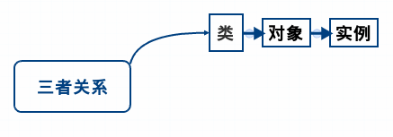

#Javascript-OO

##类 对象 和 实例

####类（Class）

类（class）是对象（object）的模板，定义了实例的属性和方法。

    For example:
    水果就是一个很抽象的概念。

####对象（Object）
对象是类的一个实例，是一个特定的类。

    For example:
    水果是一个类，
    榴莲就是一个对象.

####实例（Instance）

实例化表示一个动作，去实例一个对象。或者说强调是实例。

    For example:
    水果是一个类;
    榴莲就是一个对象;
    实例就是具体到某一个榴莲。

####三者关系：

类实例化得出对象，即对象是类的实例化。



##JS中如何定义Class？

两种方法：

    function Person() { }
    // 或
    var Person = function(){ }
例如：

```javascript
    function Person(name, age, sex){
      this.name = name;
      this.age = age;
      this.sex = sex;
    }
    function Female(name,age){
      Person.call(this,name,age,'Female');
    }
    Female.prototype = Object.create(person.prototype);
    Female.prototype.constructor = Female;
```
##JS中如何定义属性

####方法：

####1.类方法
```javascript
    fuction Person(name, age, sex){
      this.name = name;
      this.age = age;
      this.sex = sex;
    }
    Person.helloWorld = fuction(){
      return 'HelloWorld';
    }
    var helloWorld = Person.helloWorld();
    console.log(helloWorld);
```
####2.实例方法
```javascript
    function Person(name, age, sex){
      this.name = name;
      this.age = age;
      this.sex = sex;
    }
     Person.prototype.gethName = fuction(){
     return this.name;
    }
    var person = new Person('Joy',18,'Female');
    var name = person.getName();
    console.log(name);
```
##三要素
####1.封装
实现数据隐藏。隐身实现细节，当私有部分的实现完全重写时，并不需要改变调用者的行为。
```javascript
    function Car(person){
      this.crew = person;
    }
    Car.prototype.getDriverName = function(){
      return this.crew.name;
    }
```
####2.继承
继承就像现实中的父与子的关系，儿子继承了父亲的一些特性，即面向对象语言中一个类可以继承另一个类的一些特性，从而可以代码重用。
```javascript
    function Person(name, age, sex){
      this.name = name;
      this.age = age;
      this.sex = sex;
    }
    function Female(name,age){
      Person.call(this,name,age,'Female');
    }
    Female.prototype = Object.create(person.prototype);
    Female.prototype.constructor = Female;
    function Male(name, age){
      Person.call(this,name,age,'Male');
    }
    Male.prototype = Object.create(Person.prototype);
    Male.prototype.constructor = Male;
```
####3.多态
通过同一个方法，但表现出来的结果却不一样。
```javascript
    var fanfan = new Female('Gao Fanfan',22);
    var jianqun = new male('Zhang jianqun',23);
    var persons = [fanfan, jianqun];
    for(var i = 0;i < persons.length; i++){
      console.log(persons[i].name);
      console.log(persons[i].age);
      console.log(persons[i].sex);
    }
```
##类，对象，实例，类方法 以及 实例方法
把水果比作类，

那么苹果就是一个对象，

你手上有3个苹果，那么，每个苹果就是一个实例。

水果可以用来做果酱，

那么make果酱（）就是一个类方法；

而苹果可以用来做苹果酱，make苹果酱（）就是苹果的实例方法。
